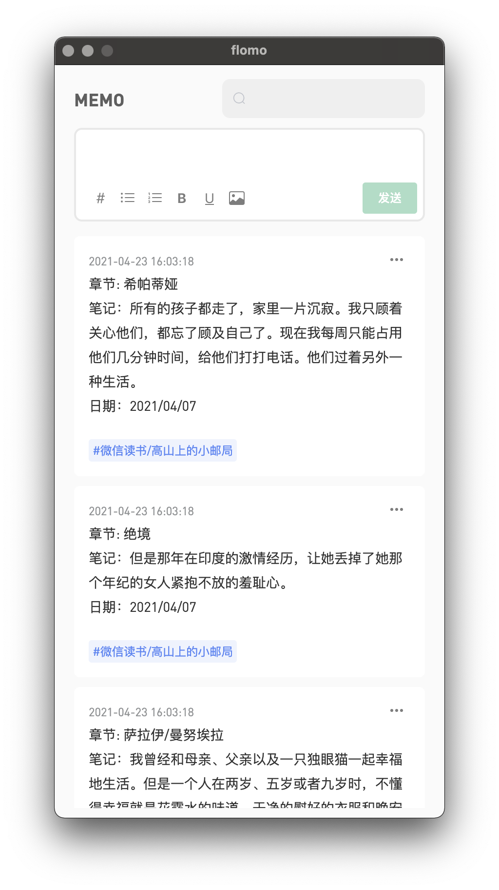

FlomoBar
===

> `Flomo` 桌面客户端集成菜单栏入口（Electron）

#### 现在，你可以从菜单栏入口快速打开 Flomo 输入框

#### 或者，你更喜欢快捷键呼出（`Shift + Cmd + F`）

#### 叮咚！从 `FlomoBar` 成功添加一条记录

#### 摆脱浏览器，即刻进入 Flomo 桌面端！

---
Find me [here](https://github.com/flomoapp/3rd-party-tools/discussions/42)~
